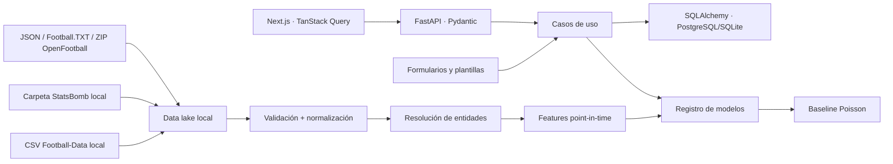

# Arquitectura del MVP

## Límites de contexto

- **Frontend:** presentación, estado de servidor y validación de formularios. No calcula predicciones.
- **API:** valida solicitudes, coordina casos de uso y serializa resultados. No conoce columnas externas.
- **Dominio:** entidades normalizadas, resolución de aliases e invariantes.
- **Datos:** importadores locales por formato/fuente, copia raw y mapeo hacia el dominio.
- **ML:** features temporales, entrenamiento, evaluación, registro y predicción.
- **Persistencia:** SQLAlchemy/Alembic; SQLite local y PostgreSQL en producción.

## Trazabilidad

Cada ingestión registra proveedor, versión del pipeline, conteos, errores, duración y fecha. Cada predicción conserva snapshot de variables, versión del modelo, calidad, estado de calibración y momento de generación; evaluar un partido actualiza el outcome, no reescribe la predicción original. Los universos mock y real se aíslan también durante la resolución de entidades.

OpenFootball añade una capa explícita de procedencia. `match_source_records` conserva el payload y archivo de cada observación; el partido de dominio sólo representa la entidad consolidada. Una clave de enlace combina fecha normalizada, local, visitante, competición y temporada. Las discrepancias quedan registradas y pendientes de resolución: una importación nunca reemplaza silenciosamente el resultado aportado por otra fuente.

Los catálogos locales conservan código/nivel/tipo de competición, alias, ciudad/estadio/fundación de club y datos biográficos disponibles del jugador en columnas de identidad y `catalog_metadata`. Los campos de rendimiento del jugador permanecen nulos. `openfootball_entity_mappings` registra repositorio, nombre original, normalización, entidad interna, confianza y verificación manual; una decisión manual no se borra al reprocesar.

## Operación offline-first

No existe una capa activa de datos deportivos en vivo. Los próximos partidos, lesiones, suspensiones, árbitros y alineaciones se importan desde archivos o se capturan manualmente. El backend sólo lee disco y su propia base durante el uso normal; cualquier descarga pública es un paso opcional y previo.

En web, OpenFootball se carga como binarios locales y rutas relativas mediante `multipart/form-data`; el servidor no acepta rutas absolutas solicitadas por el navegador. El flujo es previsualización → confirmación: detectar y validar no persiste partidos. La CLI sí puede leer una ruta local explícita porque se ejecuta en la misma máquina y proceso autorizado por el usuario.

## Resolución de entidades

1. Se normaliza Unicode, espacios, caja y acentos sólo para comparar.
2. Se intenta alias exacto previamente aprobado.
3. Una coincidencia aproximada produce candidato y score.
4. Scores ambiguos quedan en conflicto para revisión manual.
5. Nunca se crea una unión automática de alto riesgo.

## Seguridad y operación

- CORS limitado por entorno y entradas validadas.
- Secretos sólo por variables; los logs no incluyen claves.
- Importaciones con tamaño limitado, ZIP sin path traversal y paths locales controlados.
- Entrenamiento e ingestión son procesos separados de la API.
- Paginación e índices deben acompañar el crecimiento de tablas.
- Autenticación queda preparada, pero el MVP no debe exponerse públicamente con datos privados.
